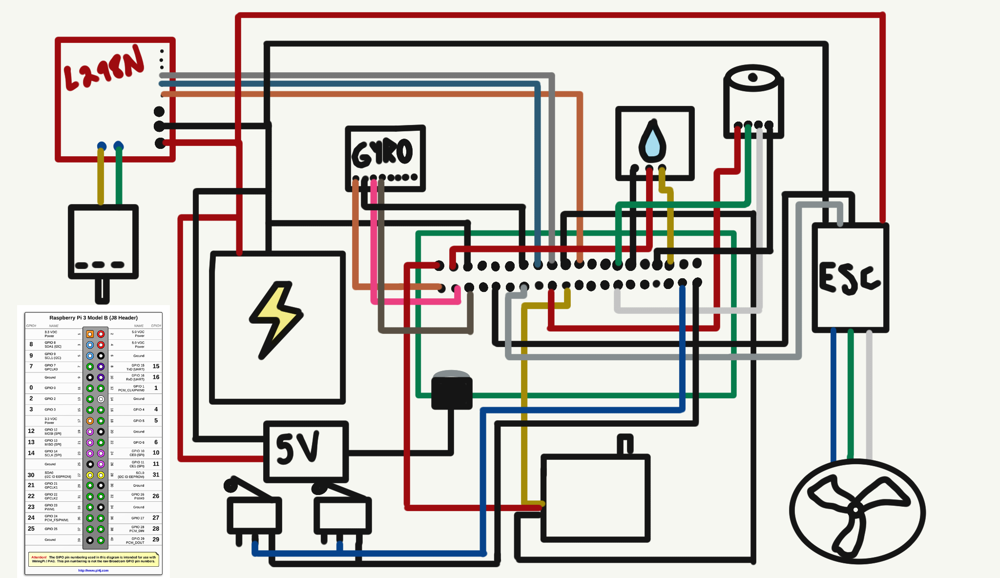

# ROV (Remotely Operated Vehicle) with Single Thruster, Servo, Rudder, and Raspberry Pi

 <!-- Replace with an actual image of your ROV -->

This project focuses on building a Remotely Operated Vehicle (ROV) using various components like a single thruster, a servo, a rudder, a DC motor, a ballast tank, an L298N H-bridge, a gyro/accelerometer, 3D printed parts, a battery, an acrylic housing, and a 5V step-down converter. The ROV can be controlled remotely using a Logitech controller and provides functionalities for forward and backward movement, servo control, motor arming/disarming, and more.

## Hardware Components
- 1 Thruster
- 1 Basic ESC
- 1 Servo
- 1 Rudder
- 1 DC Motor
- 1 Ballast Tank
- L298N H-bridge
- Gyro/Accelerometer
- 3D Printed Parts
- Battery
- Acrylic Housing
- 5V Step-Down Converter
- Raspberry Pi
- Logitech Controller
- GPIO Cables
- 2 Limit Switches

## Software
The project involves writing Python code (`rov.py`) to control the ROV. The code uses libraries such as `pygame` for joystick input and `pigpio` for controlling GPIO pins on the Raspberry Pi.

## Installation and Setup
1. Connect the hardware components to the Raspberry Pi following the wiring diagram.
2. Install required libraries using pip: `pip install pygame pigpio`.
3. Upload the provided code (`rov.py`) to your Raspberry Pi.

## Wiring Diagram
 <!-- Replace with an actual wiring diagram -->

## 3D Printed Parts
You can find the 3D models for the ROV components in the `3d_models` directory. Print these parts using your 3D printer.

## Code Explanation
The provided Python code (`rov.py`) does the following:

- Initializes GPIO pins and sets up joystick input.
- Maps joystick values to appropriate pulse widths for motor and servo control.
- Controls the motor's throttle and direction based on joystick input.
- Controls the servo's angle based on joystick input.
- Arming and disarming the motor using button input from the joystick.

## Usage
1. Connect the ROV to the power source.
2. Run the `rov.py` script on the Raspberry Pi.
3. Use the Logitech joystick to control the ROV's movement and servo.

## Note
Make sure to adjust GPIO pin numbers, joystick axis/button indices, and calibration values in the code to match your specific hardware setup.

## Contributions
Contributions to this project are welcome! Feel free to fork this repository, make improvements, and create pull requests.

## Acknowledgments
Special thanks to the open-source community, libraries like `pygame` and `pigpio`, and contributors who make projects like this possible.

## Future Goals
In the quest for continuous improvement, several future plans are in the pipeline to enhance the ROV project:

- **Unified Control**-
Refine the codebase to synchronize the arm/disarm sequence of the DC motor with the servo and ESC. This synchronization will enhance the ROV's overall maneuverability and control.

- **Limit Switch Integration**-
Incorporate limit switches into the design to intelligently manage the ROV's plunger movement. By integrating limit switches, the system will ensure that the plunger stays within defined thresholds, preventing any undue strain or over-extension.

- **Precision Gear Track**-
Develop a precision gear track mechanism to facilitate the controlled back-and-forth movement of the DC motor's piston within the ballast tank. This gear track will enhance stability and provide more accurate depth control during ROV operation.

- **Enhanced Motor Mounting**-
Design an optimized and secure mounting solution for the DC motor. This new mounting will ensure stability and alignment, reducing vibration and potential misalignment during the ROV's operation.

- **Shelf Adjustments**-
Fine-tune the mounting hole placements on the shelf to ensure an ideal fit for all components. This adjustment will streamline the assembly process, providing a snug and efficient arrangement for all the ROV parts.
